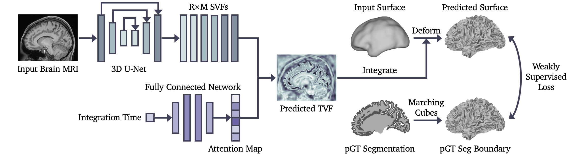
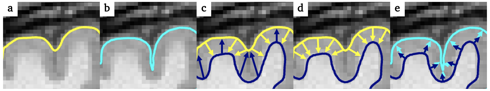

# Weakly Supervised Learning of Cortical Surface Reconstruction from Segmentations

[](https://arxiv.org/abs/2406.12650)
[](https://opensource.org/licenses/Apache-2.0)
[](https://pytorch.org/)
[](https://pytorch3d.org/)

This is the official PyTorch implementation of the paper: [Weakly Supervised Learning of Cortical Surface Reconstruction from Segmentations](https://papers.miccai.org/miccai-2024/841-Paper1517.html) (MICCAI 2024). We proposed CoSeg, a deep learning-based cortical surface reconstruction framework weakly supervised by pseudo ground truth brain segmentations.


The architecture of the Temporal Attention Network (TA-Net).


(a) The cGM segmentation boundary; (b) The expected pial surface; (c) Bidirectional Chamfer distance between the cGM segmentation boundary and input white surface; (d) The boundary loss, i.e., single-directional Chamfer distance; (e) The inflation loss between the vertex displacement and the normal vector of the input white surface.


## Installation
Our CoSeg framework requires the following dependencies:
* PyTorch == 1.7.1
* PyTorch3D == 0.4.0 (for training only)
* Nibabel == 3.2.1
* Trimesh == 3.9.15
* NumPy == 1.23.5
* SciPy == 1.10.0
* Scikit-image == 0.18.1
* ANTsPy == 0.3.4 (for registration only)


## Dataset
This paper is evaluated on the [HCP young adult dataset](https://www.humanconnectome.org/study/hcp-young-adult/data-releases) and the [dHCP fetal dataset](https://biomedia.github.io/dHCP-release-notes/). For the HCP data, we use the T1w brain MRI ```T1_restore.nii.gz``` and cortical ribbon segmentation ```ribbon.nii.gz``` under the directory ```./MNINonLinear``` of each subject for training. The T1w brain images and segmentations have already been affinely aligned to the MNI-152 space. To preprocess the HCP data, please run:
```
python ./data/data_preprocess_hcp.py --orig_dir='/YOUR_HCP_DATA/'
```
The preprocessed data will be saved to ```./data/hcp/```.


For dHCP fetal data, we use [BOUNTI](https://doi.org/10.7554/eLife.88818.1) fetal brain MRI segmentation pipeline to generate pseudo ground truth brain tissue segmentation masks. To preprocess the dHCP data, please run:
```
python ./data/data_preprocess_dhcp.py --orig_dir='/YOUR_DHCP_DATA/'
```
The preprocessed data will be saved to ```./data/dhcp/```. The T2w fetal brain MR images are affinely aligned to a 36-week dHCP neonatal atlas ```./template/dhcp_fetal_week36_t2w.nii.gz```. The labels of BOUNTI brain tissue segmentations are merged and split into left and right brain hemispheres to create cortical ribbon segmentations for training.


## Training
To train CoSeg for left/right white/pial surface reconstruction on the HCP/dHCP dataset, please run:

```
python train.py --data_type='dhcp'\
                --surf_type='pial'\
                --surf_hemi='left'\
                --tag='EXP_ID'\
                --w_edge=0.5\
                --w_nc=5.0\
                --w_inflate=5.0\
                --n_epoch=200\
                --device='cuda:0'
```
where ```data_type=['hcp','dhcp']``` is the name of the dataset, ```surf_type=['white','pial']``` is the type of the surface, ```surf_hemi=['left','right']``` is the brain hemisphere, ```tag``` is a string to identify your experiments, and ```n_epoch``` is the number of epochs for training. ```w_edge```, ```w_nc```, and ```w_inflate``` are the weights for the edge length loss, normal consistency loss, and inflation loss.

The training process loads data from ```./data/data_type/``` and saves the model checkpoints to the ```./ckpts/data_type/``` directory. Please note that the training of white surface reconstruction is a prerequisite for the training of pial surface reconstruction. For more details of all arguments please run ```python train.py --help```.

## Inference
For the inference, please run:
```
python pred.py --data_dir='/YOUR_DATASET/YOUR_MRI.nii.gz'\
               --save_dir='/YOUR_RESULT/'\
               --data_type='dhcp'\
               --surf_hemi='left' 
```
where ```data_dir``` is the file name of the preprocessed brain MRI. The predicted surfaces will be saved to ```save_dir``` in GIfTI format ```.surf.gii```.